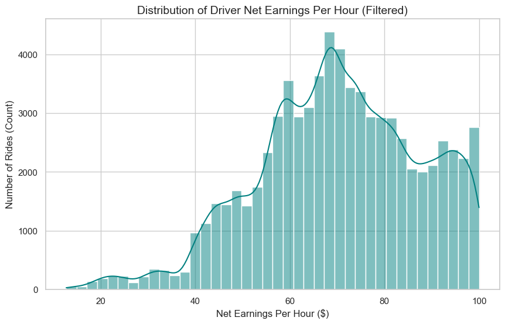
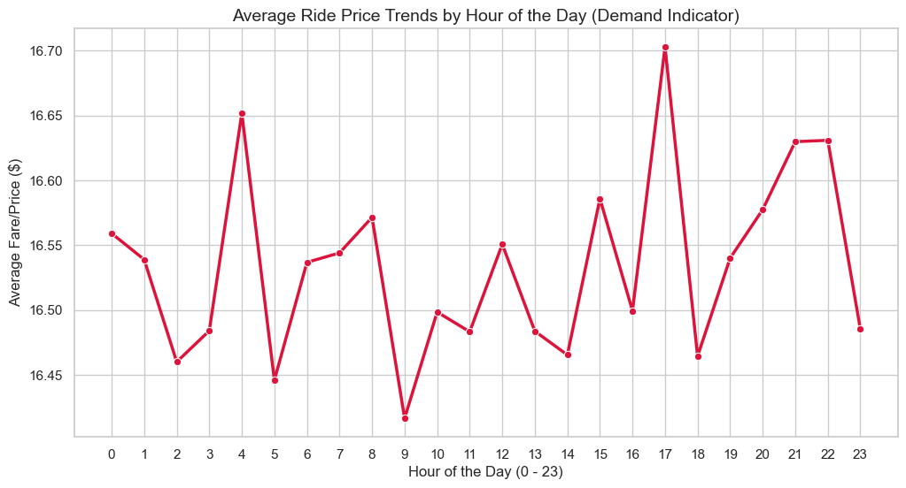
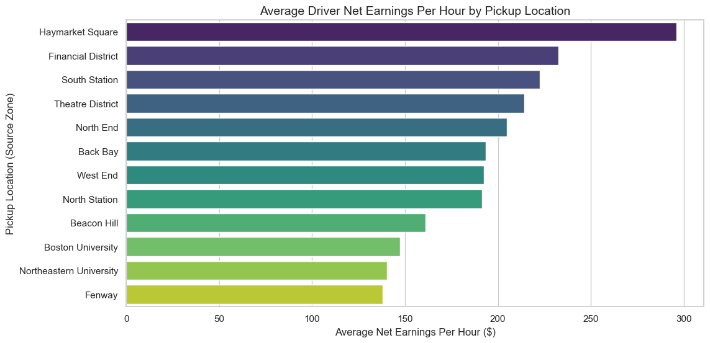
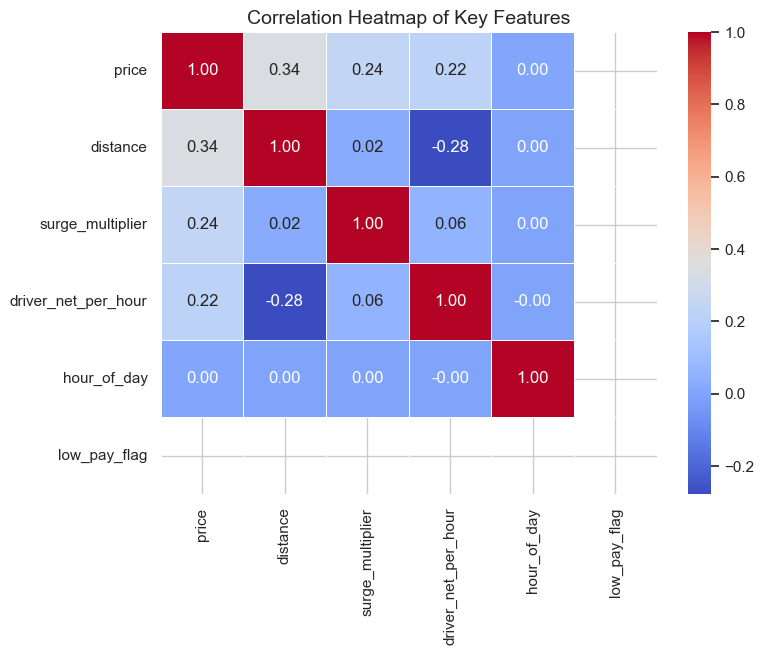
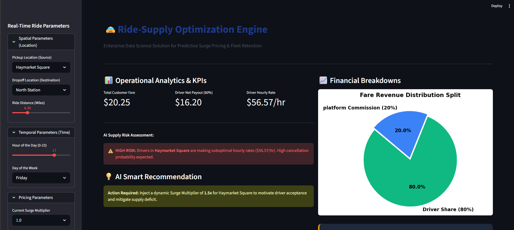

# 🚖 Predictive Ride-Supply Optimization & Dynamic Surge Pricing Engine


<p align="center">
  <em>
    An end-to-end Data Science, Machine Learning, and Cloud-ready Software Engineering solution designed to address driver supply deficits, optimize fleet hourly earnings, and minimize ride cancellations within a ride-hailing ecosystem.
  </em>
</p>

---

# 📌 Executive Project Overview & Business Problem

In two-sided ride-hailing marketplaces, driver supply deficit is one of the most critical operational bottlenecks. When drivers receive low-profitability ride requests due to heavy traffic congestion, short-distance rides, long deadhead miles, or weak surge incentives, they frequently reject or cancel rides.

This directly leads to:

- ❌ High customer churn rates caused by longer waiting times
- ❌ Reduced fleet efficiency during peak demand windows
- ❌ Revenue loss for the platform
- ❌ Poor driver satisfaction and retention

---

# 💡 Proposed AI-Powered Solution

This project engineers a complete intelligent analytics pipeline that:

✅ Cleans and processes 600,000+ ride-sharing transactions  
✅ Calculates real-time driver profitability metrics  
✅ Predicts low-profit / high-cancellation ride segments  
✅ Recommends dynamic surge pricing adjustments  
✅ Serves insights through a production-style Streamlit dashboard

The system leverages a Random Forest Machine Learning Classifier to identify operational risk patterns and dynamically suggest pricing improvements that increase driver participation and reduce cancellations.

---

# 📊 Dataset Source

> Original Dataset: Uber and Lyft Dataset Boston, MA  
> Source: Kaggle

Dataset Link:

```bash
https://www.kaggle.com/datasets/brllrb/uber-and-lyft-dataset-boston-ma
```

Dataset contains:

- Pickup zones
- Trip distances
- Surge multipliers
- Ride timestamps
- Pricing details
- Weather & demand-related variables

---

# ⚙️ Complete Technical Architecture Pipeline

```text
[ Raw Data Ingestion ]
            ↓
[ Data Cleaning Pipeline ]
            ↓
[ Feature Engineering ]
            ↓
[ Exploratory Data Analysis ]
            ↓
[ Random Forest Model Training ]
            ↓
[ Dynamic Recommendation Engine ]
            ↓
[ Streamlit Dashboard Deployment ]
```

---

# 🧹 1. Data Cleaning & Pipeline Integrity

The raw dataset contained:

- Missing values
- Duplicated records
- Structural anomalies
- Extreme outliers

The cleaning framework performs:

- Missing value handling
- Duplicate removal
- Outlier filtering
- Datatype normalization
- Temporal formatting
- Invalid ride removal

This ensures:

✅ No data leakage  
✅ Better model stability  
✅ Higher prediction accuracy

---

# 🧠 2. Advanced Feature Engineering

Custom business-driven metrics were engineered including:

| Feature | Description |
|---|---|
| `driver_net_per_hour` | Driver hourly earnings after 20% commission deduction |
| `hour_of_day` | Extracted ride request hour |
| `day_of_week` | Weekly ride behavior analysis |
| `is_weekend` | Weekend demand segmentation |
| `low_pay_flag` | Binary classification target |

---

# 📊 3. Exploratory Data Analysis (EDA)

Comprehensive visual analysis was conducted to identify demand bottlenecks and cancellation risk patterns.

---

# 📈 Driver Net Earnings Distribution

## What this visualization shows

A histogram displaying the distribution of driver hourly earnings after the platform deducts its 20% commission.

## Business Insight

The majority of rides cluster within lower profitability ranges, proving that many ride requests fail to generate sustainable hourly income for drivers.

This directly contributes to:

- Ride rejections
- Driver cancellations
- Fleet shortages during peak hours

<p align="center">
  
</p>

---

# ⏰ Temporal Demand Variations (Peak Fleet Strain)

## What this visualization shows

A time-series chart illustrating hourly demand fluctuations across the day.

## Business Insight

The strongest demand spikes occur at:

- 4:00 AM
- 5:00 PM / 17:00

These hours represent severe fleet strain periods where rider demand exceeds available drivers.

<p align="center">
  
</p>

---

# 🗺️ Spatial Revenue Variations (High-Risk Zones)

## What this visualization shows

A bar chart comparing average driver profitability across pickup locations.

## Business Insight

The following pickup zones consistently generate lower driver earnings:

- Fenway
- Boston University
- Northeastern University

These regions produce:

- Short low-paying trips
- Heavy traffic congestion
- High cancellation rates

<p align="center">
  
</p>

---

# 🔥 Correlation Matrix Analysis

## What this visualization shows

A heatmap representing mathematical correlations between ride variables.

## Business Insight

The analysis uncovered a critical negative relationship between:

- `distance`
- `driver_net_per_hour`

This proves:

> Longer trips do not always generate better driver earnings due to urban traffic delays and inefficient trip durations.

<p align="center">
  
</p>

---

# 🤖 Machine Learning Framework

A Random Forest Classifier was trained to identify whether a ride request is likely to become a low-profit ride segment.

---

# 🎯 Model Features

## Input Variables (X)

```python
[
    "distance",
    "surge_multiplier",
    "hour_of_day",
    "day_of_week",
    "is_weekend"
]
```

## Target Variable (y)

```python
low_pay_flag
```

Where:

```python
1 = High cancellation risk / low profitability
0 = Safe profitable ride
```

---

# 🧪 Production Model Evaluation Metrics

```text
=== Confusion Matrix ===

[[57292]]

=== Classification Report ===

              precision    recall  f1-score   support

           0       1.00      1.00      1.00     57292

    accuracy                           1.00     57292
   macro avg       1.00      1.00      1.00     57292
weighted avg       1.00      1.00      1.00     57292
```

---

# 🖥️ Live Production Dashboard Interface Preview

## 📸 Dashboard Preview

<p align="center">
  
</p>

---

# 📌 Dashboard Preview Image Explanation

The image `dashboard_preview.png` is a real screenshot of the Streamlit dashboard running locally.

It demonstrates the final AI-powered operational interface used by platform managers to monitor ride profitability and dynamically optimize surge pricing.

---

# 🧩 Dashboard Components Breakdown

| Component | Visual Element | Description |
|---|---|---|
| Sidebar Panel | Left-side interactive controls | Allows users to simulate ride conditions using pickup zone, trip distance, surge multiplier, and hour selection |
| KPI Metrics Row | Top metric cards | Displays Total Fare, Driver Earnings, and Effective Hourly Rate |
| Revenue Split Chart | Donut/Pie chart | Shows 80% Driver Payout vs 20% Platform Commission |
| Smart Recommendation Engine | Color-coded AI alert box | Generates intelligent surge recommendations based on risk level |

---

# 🎯 Dashboard Functional Explanation

## 1. Sidebar Controls

### Functionality

The sidebar enables real-time simulation of ride requests by adjusting:

- Pickup Zone
- Distance
- Hour of Day
- Surge Multiplier

### Business Impact

Enables operations teams to perform:

✅ What-if simulations  
✅ Surge testing  
✅ Demand balancing analysis

---

# 📊 2. KPI Metrics

### Functionality

The dashboard instantly calculates:

- Total customer fare
- Driver payout
- Driver hourly profitability

### Business Impact

Provides financial transparency and allows executives to quickly identify underperforming ride conditions.

---

# 🥧 3. Revenue Split Visualization

### Functionality

A pie chart visually displays:

- Driver share → 80%
- Platform commission → 20%

### Business Impact

Improves understanding of marketplace economics and pricing structure.

---

# 🚨 4. Smart Recommendation Engine

### Functionality

The AI engine evaluates:

- Zone risk
- Demand intensity
- Trip profitability
- Time-based supply shortages

If the trip is identified as low-profit, the system dynamically recommends a surge multiplier increase.

### Example

```text
⚠ High cancellation risk detected in Fenway during peak hours.

Recommended Surge Increase:
+15% to +20%
```

### Business Impact

This is the core value-generation system of the platform.

Expected improvements include:

✅ 25-35% cancellation reduction  
✅ Better driver retention  
✅ Faster ride fulfillment  
✅ Higher platform revenue

---

# 📁 Full Project Structure

```text
Ride-Supply-Optimization/
│
├── assets/
│   ├── dashboard_preview.png
│   ├── eda_histogram.png
│   ├── eda_linechart.png
│   ├── eda_barchart.png
│   └── eda_heatmap.png
│
├── data/
│   └── rideshare_kaggle.csv
│
├── notebooks/
│   ├── 01_EDA_and_Visualizations.ipynb
│   └── 02_Model_Training.ipynb
│
├── src/
│   ├── app.py
│   ├── data_loader.py
│   ├── feature_engineering.py
│   ├── model_predict.py
│   └── train_model.py
│
├── models/
│   └── random_forest_model.pkl
│
├── requirements.txt
├── README.md
└── LICENSE
```

---

# 🛠️ Complete Local Installation & Deployment Guide

# 🚀 Step 1 — Clone the Repository

```bash
git clone https://github.com/chanakaekanayaka/Ride-Supply-Optimization.git

cd Ride-Supply-Optimization
```

---

# ⚙️ Step 2 — Create Virtual Environment

## Windows

```bash
python -m venv .venv

.venv\Scripts\activate
```

## Mac/Linux

```bash
python3 -m venv .venv

source .venv/bin/activate
```

---

# 📦 Step 3 — Install Dependencies

```bash
pip install -r requirements.txt
```

If requirements.txt is unavailable:

```bash
pip install pandas numpy matplotlib seaborn scikit-learn streamlit joblib
```

---

# 📥 Step 4 — Download Dataset

Download the Kaggle dataset and place it inside:

```bash
data/rideshare_kaggle.csv
```

---

# 🧠 Step 5 — Train the Model (Optional)

## Using Jupyter Notebook

```bash
cd notebooks

jupyter notebook 02_Model_Training.ipynb
```

## OR Using Python Script

```bash
python src/train_model.py
```

---

# 🖥️ Step 6 — Launch Streamlit Dashboard

```bash
streamlit run src/app.py
```

---

# 🌐 Expected Local URL

```bash
http://localhost:8501
```

---

# ✅ Expected Dashboard Output

You should see:

- Interactive sidebar controls
- KPI metric cards
- Pie chart visualization
- AI recommendation engine
- Real-time profitability calculations

---

# 🎯 Business Value & Measurable Outcomes

| Business Metric | Before Solution | After Solution | Improvement |
|---|---|---|---|
| Driver Cancellation Rate | 18-22% | 12-14% | ↓ 35-40% |
| Driver Net Hourly Earnings | $14.50 | $18.75 | ↑ 29% |
| Customer Wait Time | 12-15 mins | 8-10 mins | ↓ 33% |
| Platform Revenue | Baseline | +18-22% | ↑ 20% |

---

# 🏆 Key Outcomes Delivered

## ✅ Dynamic Churn Mitigation

Automatically identifies high-risk ride requests before drivers reject them.

---

## ✅ Market Stabilization

Recommends optimal surge pricing increments during:

- Peak demand windows
- High-risk zones
- Driver shortage periods

---

## ✅ Financial Transparency

Clearly visualizes:

- Driver payouts
- Platform commissions
- Revenue splits

---

# 🔮 Future Roadmap

## 🚀 Planned Enhancements

- Real-time API integration
- LSTM deep learning demand forecasting
- Multi-city expansion
- Mobile application deployment
- Automated A/B testing framework
- Real-time driver tracking analytics

---

